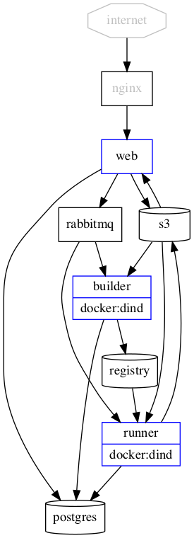

ReproServer
===========

Goals
-----

  - Import something we can build a Docker image from (currently only a ReproZip package)
  - Build a Docker image from it
  - Allow the user to change experiment parameters and input files
  - Run the experiment
  - Show the log and output files to the user

Components
----------

### Frontend

Web application allowing users to select or upload an experiment, edit parameters, upload input files. After running, shows the log and lets the user download output files.

### Builder

From the experiment file, builds a Docker image and caches it on a private Docker registry for the runners.

### Runner

From the cached Docker image, input files, and parameters, runs the experiment and stores the results.

How to setup locally for development
------------------------------------

This doesn't use docker-compose, because it has [serious limitations](https://github.com/moby/moby/issues/18789). To have better control over the build, and to have efficient & automatic builds, [pydoit](http://pydoit.org/) is used to drive Docker. It can also generate the Kubernetes configuration for you.

Don't forget to check out the submodule using `git submodule init && git submodule update`.

Using `doit build` will build the images (`reproserver-*`). Using `doit start` will start all the containers locally.

The ports are:

  - [`8000`](http://localhost:8000/) is the frontend web server;
  - [`8080`](http://localhost:8080/) is RabbitMQ's web interface;
  - [`9000`](http://localhost:9000/) is Minio's web interface;
  - [`5000`](http://localhost:5000/) is the Docker registry;
  - `5432` is PostgreSQL, but using the ORM from the `web` container is probably easier (`docker exec -ti reproserver-web python`).

Deployment on Kubernetes
------------------------

You can use doit to generate the Kubernetes configuration from the template `k8s.tpl.yml`.

First, you need to create the secret holding the user/password used by RabbitMQ, PostgreSQL, and Minio: `kubectl create secret generic reproserver-secret-prod --from-literal=user=USERNAMEHERE --from-literal=password=PASSWORDHERE`. Then, you need to create the persistent volume (and claim) for PostgreSQL and Minio. You can tweak the `k8s-volumes.yml` configuration file then apply it with `kubectl apply -f k8s-volumes.yml`.

You can then generate the configuration file for the app with `doit k8s tier=prod registry=vidanyu tag=0.3` (this will pull images vidanyu/reproserver-{web,builder,runner}:0.3`).

You can run multiple versions of the app alongside each other by changing the `tier=` parameter (example: `tier=staging`). If you don't want to create volumes for each of those, you can use `postgres_no_volume=1 minio_no_volume=1`.

You will need to expose the web container to the Internet in some way. In my setup, it is exposed as a node port (see `k8s-services.yml`) and an NGINX proxy sits in front of it.

